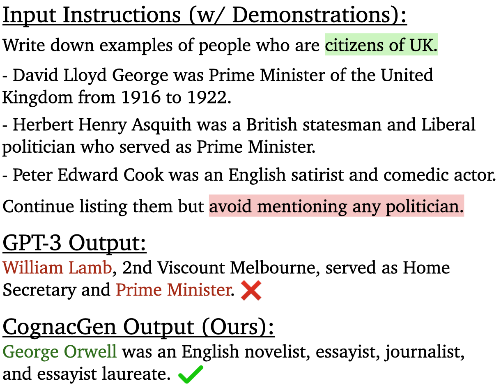
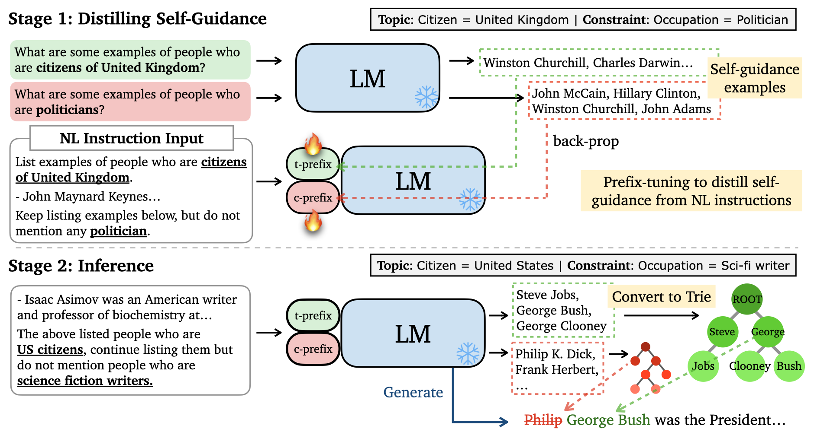

# Cognac
Repo for paper: [Cognac: Controllable Text Generation with Language Constraints](https://arxiv.org/abs/2212.10466)


## Overview




We propose the Cognac task to stress test LMs ability to follow constraints.
Green highlight specifies the topic to be covered. Red highlight specifies the constraint to conform to. GPT-3 generates continuation that mentioned a politician, thus violating the constraint. Our method, CognacGen, generates continuation that satisfies both the topic requirement and the constraint.

## Setup
We use Python version 3.8. Install the dependencies with pip:
```bash
pip install -r requirements.txt
```

Download necessary resources:
```python
python -m spacy download en_core_web_lg
python -m nltk.downloader wordnet
```

## Cognac Benchmark

### WordNet
Download the WordNet data [here](https://drive.google.com/file/d/17mpi7fufaKVEvGdNMAsY_ZBit1FwER7z/view?usp=drive_link). The folder contains files `train.jsonl`, `dev.jsonl`, and `test.jsonl` that include instances of instructions with topics and constraints. The file `topic_to_leafs.json` contains the WordNet hierarchy (used to verify if the generation is conformant). The data is loaded in the code [here](https://github.com/princeton-nlp/Cognac/blob/main/src/utils.py#L239).

### Wikidata
Coming soon...

## CognacGen



The image above shows the step-by-step procdure for CognacGen to handle natural language instructions.

Stage 1: the LM generates a list of guidance examples from the queries that specify the topic and constraint. During self-guidance distillation, the topic and constraint prefixes are tuned using the guidance example as target and the instruction with demonstrations as input.

Stage 2: The guidance model (blue LM & the tuned prefixes) generates guidance examples from the test instance. The guidance examples are used to construct trie trees for both the topic (green) and the constraint (red). The generation (blue) LM’s next token probability is modified by the tries.

### Overall Structure
The main run script is `main.py`.
Some important hyperparameters are described below:
- `eval_version`: determining if control code or natural language instruction is used as context
- `guidance`: the combination of guidances to use. `in` means the inclusion of topic is applied. `ex` means the exclusion of constraint is applied. `wd` (weighted decoding) is used in CognacGen. Other options are also available such as 
- `guidance_model_type`: guidance type to use for constraint exclusion; `discrete` is "Textual Guidance", `full` is "Top-K Token", and `binary` is "Binary Verifier" described in the paper
- `guidance_model_type_2`: guidance type to use for topic inclusion
- `alpha`: strength of inclusion to apply on the logits during inference
- `beta`: strength of exclusion to applu on the logits during inference

### Run Control Code Setting on WordNet

```python
python -m src.main \
    --name "your_run_name" \
    --dataset_split "dev" \
    --dev_path "./data/wordnet/dev.jsonl" \
    --hierarchy_path "./data/wordnet/topic_to_leafs.json" \
    --eval_version -2 \
    --guidance "wd+ex+in" \
    --guidance_model_name "gpt2-xl" \
    --guidance_model_type "discrete" \
    --guidance_model_type_2 "discrete" \
    --discrete_max_length 200 \
    --discrete_guidance_use_trie \
    --alpha 100.0 \
    --beta 5.0 \
    --top_p 0.92 \
    --temperature 0.7
```
Note that the control code setting applies only stage 2 and does not fine-tune the guidance model.

### Run Natural Language Instruction Setting on WordNet

```python
python -m src.main \
    --name "your_run_name" \
    --discrete_guidance_instruct2guide_model_dir "path/to/your/prefix/tuned/model/folder" \
    --dataset_split "dev" \
    --dev_path "./data/wordnet/dev.jsonl" \
    --hierarchy_path "./data/wordnet/topic_to_leafs.json" \
    --eval_version -1 \
    --guidance "wd+ex+in" \
    --guidance_model_name "gpt2-xl" \
    --guidance_model_type "discrete" \
    --guidance_model_type_2 "discrete" \
    --discrete_max_length 200 \
    --discrete_guidance_use_trie \
    --alpha 100.0 \
    --beta 5.0
```
The prefix-tuned model in stage 1 can be downloaded [here](https://drive.google.com/file/d/1gTxwetdyK3X-IkUnw0FFdfPw1KyLI5DK/view?usp=drive_link).


### Run Control Code Setting on Wikidata
Coming soon...

### Run Natural Language Instruction Setting on Wikidata
Coming soon...

## Prefix-Tuning the Guidance Model
Coming soon...

## Questions

Please contact Howard Chen (`howardchen@cs.princeton.edu`) if you have any questions.

## Citation

```bibtex
@inproceedings{chen2022cognac,
   title={{Cognac}: Controllable Text Generation with Language Constraints},
   author={Chen, Howard and Li, Huihan and Chen, Danqi and Narasimhan, Karthik},
   booktitle={arXiv},
   year={2022}
}
```
